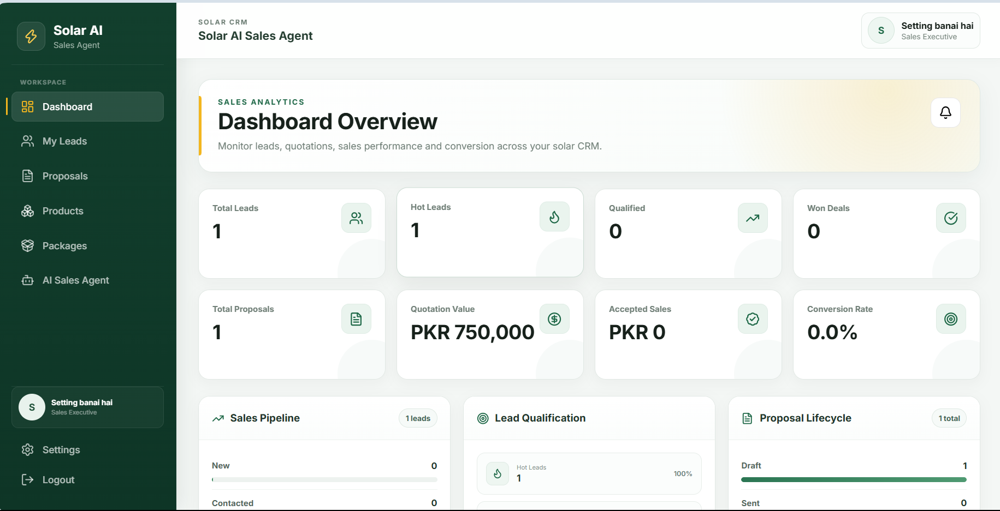
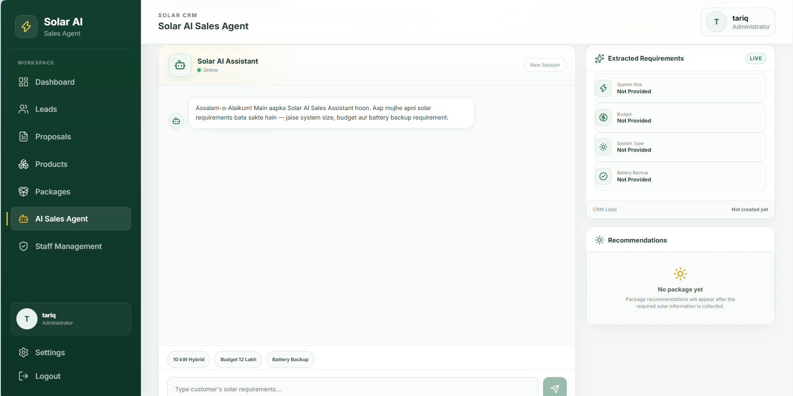
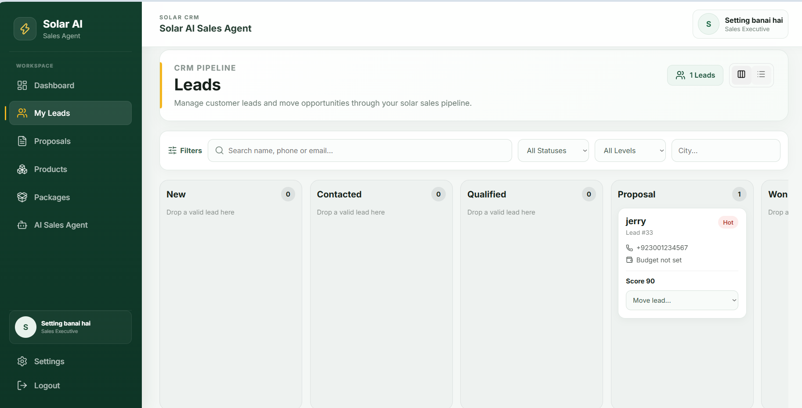

# Solar AI Sales Agent

An AI-powered solar sales and CRM platform that combines conversational solar consultation, deterministic system sizing, product/package recommendations, lead management, quotations, PDF proposals, follow-ups, sales tasks, staff management, and role-based access control.

The project is built as a full-stack application with a **FastAPI + SQL Server** backend and a **React + Vite** frontend.

> **Project status:** Functional local application. Core CRM, AI sales, RBAC, proposal/PDF, staff, and account settings workflows have been implemented and tested locally. Deployment configuration is not included yet.

---

## Key Features

### AI Solar Sales Agent
- Conversational solar sales assistant.
- Uses **Groq** with the `openai/gpt-oss-20b` model for language understanding and sales responses.
- Extracts customer requirements such as:
  - Budget
  - Required system size
  - System type
  - Backup requirement
  - Monthly electricity units
  - Appliance usage
  - Customer contact information
  - Quotation intent
- Maintains persistent chat sessions and message history.
- Supports Roman Urdu / English conversation handling.
- Can convert qualified customer conversations into CRM leads.
- Can generate quotation information during the AI sales flow.

### Deterministic Solar Sizing
The LLM is used to understand customer language, but final preliminary sizing calculations are handled by backend logic rather than being left to the LLM.

Sizing can use:
- Appliance quantities
- Appliance wattage
- Daily usage hours
- AC tonnage
- Monthly electricity units

The sizing service returns:
- Estimated peak load
- Estimated daily energy consumption
- Recommended solar system size
- Estimated battery requirement where applicable
- Calculation assumptions

> Sizing results are preliminary sales estimates and are not a replacement for final engineering/site design.

### Lead & CRM Management
- Lead creation and listing.
- Lead detail view.
- Sales pipeline statuses:
  - New
  - Contacted
  - Qualified
  - Proposal
  - Won
  - Lost
- Lead qualification information.
- Lead assignment to Sales Executives.
- Follow-up scheduling.
- Open sales task tracking.
- Lead notes with CRUD operations.
- CRM activity timeline.
- Dashboard summary and recent activities.
- Sales Executive data scoping to assigned leads.

### Products & Solar Packages
Product catalog supports specialized solar products including:
- Solar panels
- Inverters
- Batteries

Package management supports:
- System size
- System type
- Package pricing
- Product quantities
- Active/inactive status
- Detailed product specifications

Catalog write operations are restricted through backend RBAC.

### Recommendation Engine
The backend recommendation service can match customer requirements with available solar packages using structured application logic and package data.

### Proposals & Quotations
- Create proposals from CRM leads and verified packages.
- Backend-calculated pricing.
- Product snapshots stored in proposals.
- Discounts and notes.
- Proposal lifecycle:
  - Draft
  - Sent
  - Accepted
  - Rejected
- Authenticated PDF quotation generation/download.
- Proposal access is scoped for Sales Executives according to lead assignment.
- Accepted proposal workflow can synchronize with CRM state.

### Authentication & RBAC
Internal CRM authentication uses:
- JWT bearer authentication
- bcrypt password hashing
- Active/inactive staff accounts

Supported staff roles:

| Capability | Admin | Sales Manager | Sales Executive |
|---|:---:|:---:|:---:|
| CRM dashboard | Yes | Yes | Scoped |
| View all leads | Yes | Yes | No |
| View assigned leads | Yes | Yes | Yes |
| Assign/reassign leads | Yes | Yes | No |
| Lead tasks/follow-ups | Yes | Yes | Assigned leads |
| Lead notes | Yes | Yes | Assigned leads |
| Proposals | Yes | Yes | Assigned leads |
| Read product/package catalog | Yes | Yes | Yes |
| Manage product/package catalog | Yes | No | No |
| Staff management | Yes | No | No |
| Personal settings | Yes | Yes | Yes |

The frontend role guard improves navigation/UX, while the **backend remains the authoritative security layer**.

### Staff Management
Administrators can:
- View staff accounts.
- Create Sales Managers and Sales Executives.
- Activate/deactivate staff.
- Use the Sales Executive directory for assignment workflows.

### Account Settings
All authenticated CRM staff can:
- View account information.
- Update their own name and email.
- Change their password after current-password verification.

Role and account status are not editable from personal settings.

---

## Tech Stack

### Backend
- Python
- FastAPI
- SQLAlchemy
- Microsoft SQL Server
- pyodbc
- Alembic
- Pydantic
- PyJWT
- bcrypt
- Groq SDK
- ReportLab
- phonenumbers

### Frontend
- React 19
- Vite
- React Router
- Axios
- Lucide React
- CSS

### Database
- Microsoft SQL Server
- Windows Authentication / Trusted Connection
- Alembic database migrations

---

## Architecture

```text
Customer / CRM Staff
        |
        v
React + Vite Frontend
        |
        | HTTP / JSON
        | JWT for protected CRM requests
        v
FastAPI Backend
   |        |         |
   |        |         +----> Groq LLM
   |        |                Language understanding
   |        |                Requirement extraction
   |        |                Sales responses
   |        |
   |        +--------------> Deterministic Services
   |                         Solar sizing
   |                         Qualification
   |                         Recommendations
   |                         Proposal pricing
   |
   +-----------------------> SQLAlchemy + pyodbc
                              |
                              v
                        Microsoft SQL Server
```

The application deliberately separates AI language processing from important deterministic business calculations such as preliminary solar sizing and proposal pricing.

---

## Project Structure

```text
solar-ai-sales-agent/
├── backend/
│   ├── app/
│   │   ├── api/
│   │   │   └── routes/
│   │   │       ├── agent.py
│   │   │       ├── auth.py
│   │   │       ├── leads.py
│   │   │       ├── packages.py
│   │   │       ├── products.py
│   │   │       ├── proposals.py
│   │   │       ├── recommendations.py
│   │   │       └── users.py
│   │   ├── database/
│   │   │   └── database.py
│   │   ├── models/
│   │   ├── schemas/
│   │   ├── services/
│   │   └── main.py
│   ├── migrations/
│   │   └── versions/
│   ├── scripts/
│   │   └── create_admin.py
│   ├── alembic.ini
│   └── requirements.txt
├── frontend/
│   ├── src/
│   │   ├── components/
│   │   │   ├── auth/
│   │   │   └── layout/
│   │   ├── pages/
│   │   │   ├── AIAgent.jsx
│   │   │   ├── Dashboard.jsx
│   │   │   ├── LeadDetails.jsx
│   │   │   ├── Leads.jsx
│   │   │   ├── Login.jsx
│   │   │   ├── Packages.jsx
│   │   │   ├── Products.jsx
│   │   │   ├── ProposalDetails.jsx
│   │   │   ├── Proposals.jsx
│   │   │   ├── Settings.jsx
│   │   │   └── StaffManagement.jsx
│   │   ├── services/
│   │   │   └── api.js
│   │   ├── App.jsx
│   │   └── main.jsx
│   ├── package.json
│   └── vite.config.js
└── README.md
```

---

## Prerequisites

Before running the project locally, install:

- Python 3
- Node.js and npm
- Microsoft SQL Server / SQL Server Express
- Microsoft ODBC Driver for SQL Server
- Git (recommended)

The current development database configuration uses **Windows Authentication**.

---

## Backend Setup

### 1. Open the backend directory

```powershell
cd solar-ai-sales-agent\backend
```

### 2. Create a virtual environment

```powershell
python -m venv .venv
```

### 3. Activate it

PowerShell:

```powershell
.\.venv\Scripts\Activate.ps1
```

Command Prompt:

```cmd
.venv\Scripts\activate.bat
```

### 4. Install dependencies

```powershell
pip install -r requirements.txt
```

### 5. Configure environment variables

Create:

```text
backend/.env
```

Use this structure:

```env
DB_SERVER=YOUR_SQL_SERVER
DB_NAME=SolarAISalesAgent
DB_DRIVER=ODBC Driver 18 for SQL Server

GROQ_API_KEY=YOUR_GROQ_API_KEY

JWT_SECRET_KEY=REPLACE_WITH_A_LONG_RANDOM_SECRET
ACCESS_TOKEN_MINUTES=480
```

The uploaded development project also contains a `GEMINI_API_KEY` environment variable, but the current `ai_service.py` uses **Groq** as its active AI provider.

**Never commit real API keys or JWT secrets to GitHub.**

### 6. Create the SQL Server database

Create a database matching the value configured in `DB_NAME`.

Example:

```sql
CREATE DATABASE SolarAISalesAgent;
```

The backend connection uses:

```text
Trusted_Connection=yes
TrustServerCertificate=yes
```

so the Windows account running the backend must have access to the SQL Server database.

### 7. Apply database migrations

From the `backend` directory:

```powershell
alembic upgrade head
```

### 8. Create the first Administrator

```powershell
python scripts/create_admin.py
```

The script asks for:
- Admin name
- Admin email
- Password

The password must contain at least 8 characters.

### 9. Start the API

```powershell
uvicorn app.main:app --reload
```

Default local API:

```text
http://127.0.0.1:8000
```

Health check:

```text
GET /health
```

Interactive FastAPI documentation is available locally at:

```text
http://127.0.0.1:8000/docs
```

---

## Frontend Setup

Open a second terminal:

```powershell
cd solar-ai-sales-agent\frontend
```

Install packages:

```powershell
npm install
```

Start Vite:

```powershell
npm run dev
```

The backend currently allows local frontend origins:

```text
http://localhost:5173
http://127.0.0.1:5173
```

Open the URL displayed by Vite and sign in using the Administrator account created earlier.

---

## Main API Areas

| Area | Base Endpoint | Purpose |
|---|---|---|
| Authentication | `/api/auth` | Login, current profile, profile update, password change |
| AI Sales Agent | `/api/agent` | Customer chat and chat history |
| Leads / CRM | `/api/leads` | Leads, dashboard, activities, tasks, notes, assignment |
| Products | `/api/products` | Solar product catalog |
| Packages | `/api/packages` | Solar packages and package administration |
| Recommendations | `/api/recommendations` | Package recommendations |
| Proposals | `/api/proposals` | Quotations, lifecycle and authenticated PDFs |
| Staff | `/api/users` | Internal staff administration |

Use FastAPI's `/docs` page for the complete generated request/response schema.

---

## Authentication Flow

```text
Staff Login
   |
   v
POST /api/auth/login
   |
   +--> bcrypt credential verification
   |
   v
JWT Access Token
   |
   v
Frontend stores authenticated session
   |
   v
Axios attaches Bearer token
   |
   v
Protected FastAPI CRM endpoints
   |
   v
Backend RBAC + resource-level access checks
```

PDF proposal downloads are also authenticated. The frontend requests protected PDF data with the authenticated Axios client and downloads the returned blob rather than relying on an unauthenticated direct browser URL.

---

## AI Sales Flow

```text
Customer Message
      |
      v
Chat Session / Memory
      |
      v
Groq Requirement Extraction
      |
      +---- General question? ----> AI response
      |
      v
Structured Customer Requirements
      |
      v
Deterministic Solar Sizing
      |
      v
Package Recommendation
      |
      v
Lead Creation / Qualification
      |
      v
Quotation Intent
      |
      v
Proposal + PDF
```

---

## CRM Role Model

### Administrator
Full internal CRM access, including staff management, lead assignment, and catalog administration.

### Sales Manager
Can work across the sales pipeline, manage leads and assignments, proposals, follow-ups and sales activity, but does not manage staff accounts or catalog write operations.

### Sales Executive
Works with assigned leads and their associated tasks, notes, follow-ups and proposals. Catalog access is read-only and CRM visibility is scoped.

### Customer
The customer-facing AI chat flow is separate from internal CRM staff authentication.

---

## Useful Development Commands

Backend:

```powershell
uvicorn app.main:app --reload
alembic current
alembic heads
alembic upgrade head
```

Frontend:

```powershell
npm run dev
npm run build
npm run lint
npm run preview
```

---

## Security Notes

- Passwords are hashed using bcrypt.
- JWT secret is loaded from environment variables.
- Protected CRM APIs require authentication.
- Backend RBAC is authoritative; hiding frontend navigation is not treated as security.
- Sales Executive access is scoped to assigned lead resources.
- Product/package write operations are restricted.
- Proposal PDF access is authenticated.
- Personal settings do not allow users to change their own role or active status.
- `.env`, API keys, generated PDFs, virtual environments, caches, and `node_modules` should not be committed.

---

## Repository Cleanup Before Publishing

Before pushing the project to a public GitHub repository:

1. Remove `backend/.env` from Git tracking and keep only an `.env.example`.
2. Rotate any API keys or JWT secrets that were ever included in a shared archive or committed repository.
3. Remove generated proposal PDFs such as local `PROP-*.pdf` files unless they are intentionally sanitized demo files.
4. Remove Python `__pycache__` directories and `.pyc` files.
5. Do not commit `.venv/` or `node_modules/`.
6. Add project screenshots under a dedicated directory such as `docs/screenshots/`.
7. Run the frontend production build and lint commands before publishing.

---

## Screenshots

Add final application screenshots here before publishing:

```text
docs/screenshots/
├── login.png
├── dashboard.png
├── leads-kanban.png
├── lead-details.png
├── ai-sales-agent.png
├── proposals.png
├── proposal-details.png
├── products.png
├── packages.png
├── staff-management.png
└── settings.png
```

Suggested README layout:

```md
## Screenshots

### Dashboard


### AI Sales Agent


### CRM Pipeline

```

---

## Current Project Status

Implemented locally:

- [x] FastAPI backend
- [x] React CRM frontend
- [x] SQL Server persistence
- [x] Alembic migrations
- [x] AI sales conversation
- [x] Persistent chat history
- [x] Customer requirement extraction
- [x] Deterministic solar sizing
- [x] Package recommendation flow
- [x] Lead creation and CRM pipeline
- [x] Lead qualification
- [x] Lead assignment
- [x] Follow-ups
- [x] Sales tasks
- [x] CRM notes
- [x] Activity timeline
- [x] Proposal lifecycle
- [x] PDF quotations
- [x] JWT authentication
- [x] Role-based access control
- [x] Staff management
- [x] Personal profile settings
- [x] Password change
- [x] Responsive CRM navigation
- [ ] Production deployment configuration
- [ ] Public production URL
- [ ] Final portfolio screenshots

---

## Future Improvements

Possible next iterations:

- Docker-based deployment.
- Cloud-hosted SQL database configuration.
- Production CORS/environment configuration.
- Email/WhatsApp proposal delivery.
- Automated follow-up notifications.
- Audit logs for security-sensitive staff changes.
- Analytics charts and conversion reporting.
- Company branding and configurable quotation templates.
- Automated tests and CI/CD.
- Customer-facing web chat widget.

---

## Author

**Tariq Bin Ziyad**  
AI Engineer / Python Developer

Portfolio: `https://tariqbinziyad09.github.io`

---

## Disclaimer

Solar sizing and recommendation outputs in this application are intended for preliminary sales assistance. Final solar system design should be verified using actual site conditions, equipment specifications, electrical requirements, shading/orientation data, and qualified engineering review.
